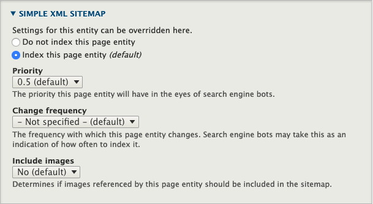

# Development

- [Development](#development)
    - [Modules](#modules)
        - [Updating Dropsolid modules](#updating-dropsolid-modules)
    - [Features](#features)
        - [Config](#config)
        - [Functional](#functional)
            - [READ EVERY SINGLE README IN EVERY SINGLE CUSTOM MODULE.](#read-every-single-readme-in-every-single-custom-module)
    - [Blocks](#blocks)
    - [Paragraphs](#paragraphs)
        - [Mixing it up](#mixing-it-up)
    - [Site building](#site-building)
                - [Page Manager](#page-manager)
                - [Homepage construction (Flex only)](#homepage-construction-flex-only)
                - [Facets](#facets)
                    - [Creating a Facet:](#creating-a-facet)
                    - [Adding a Facet to your page](#adding-a-facet-to-your-page)

## Modules

### Updating Dropsolid modules

Currently unsupported, but the plan is that they will work the same as any 
normal contrib module.

## Features

### Config

**Features, as a Drupal concept, should not be used to manage configuration 
anymore.**

We use Drupal's Config Management system.

### Functional

**From here on out**, the term **'Features'** will just be used to talk about
ready-to-use functionality that is added to our sites.
These are added using Dropsolid custom modules, installed with the Skeleton and
enabled during installation or afterwards.

[The **detailed information** can be found in Google docs.](https://docs.google.com/document/d/1JJLHBrf9HjFR0qNgCOMphM5oakNqfGLsRuan92sNp3A/edit?pli=1#heading=h.iytf5i9a7i74) so you know exactly what is supposed to be in each feature when you install it.
You will find a **list** of the numbered Features, with links to the **wires**,
functional **descriptions**, …

More in depth **technical information** and how to install/use them from a
developer's standpoint, can be found in their various repo's wiki's. Each 
feature also has its own README, with short explanation and links to the 
standard Functional Analysis and Wires for said feature. ***Read them***.

#### READ EVERY SINGLE README IN EVERY SINGLE CUSTOM MODULE.

If you ask a question, and the answer is in the README? That's a paddling.  
  

[A **status report** can be found in Google Sheets.](https://docs.google.com/spreadsheets/d/1s5Y9cr3M1tnI8cHe0B_gg4N8Zcl96ebi5okS9Jy4QmQ/edit#gid=0) So you know what the state of development is for new Features.

## Blocks

Sometimes referred to as 'Widgets'.

Blocks are entities we use to build the parts of the site that the user does
not need full control over. They are used to build the layout as it is presented
in the wires.
Unlike with paragraphs, the editor can edit the content (if we don't disable
that permission) but can not add new blocks or move them around (more on that 
below).

There is currently 1 default custom block type called 'content' but nothing 
more yet.
This block lets you use paragraphs (more on that below). We'll eventually go 
to the point where we have a solution for adding office hours, social media 
links, … like we had in D7.
But right now, you'll have to make your own.

## Paragraphs

In essence, paragraphs are elements of content that a content editor can add
into a designated area, inside another node (block, ct, even in another 
paragraph).
These give the editor an amount of control over how to construct their content 
in a visual way.

Dropsolid has made a whole list of paragraphs that can be made available for 
content editors to construct their pages (and other content types) and they 
replace the default 'body' field. Some of these have extra layout options, 
most have an optional background color.  
These are added by the Skeleton when it installs the Dropsolid Paragraphs 
module, along with its dependencies.  
You will need to check your project's technical analysis to know what types of
paragrahs you should or should not allow for the various content types. By 
default, all of them are enabled.

[The **detailed information** can be found in Google docs.](https://docs.google.com/document/d/11qOzG0PP0QRezln13RweRZ9KAyzsH4ZorqLwPbTaZ_0/edit?pli=1#heading=h.hhx2ta4hlilw) so you know exactly what is supposed to be in each paragraph and how it is supposed to work.
You will find a **list** of the numbered Paragraphs, with links to the 
**wires**, functional **descriptions**, …

[A **status report** can be found in Google Sheets.](https://docs.google.com/spreadsheets/d/1s5Y9cr3M1tnI8cHe0B_gg4N8Zcl96ebi5okS9Jy4QmQ/edit#gid=1366934568) So you know what the state of development is for new Paragraphs.

### Mixing it up

We have multiple ways to combine Paragraphs with other elements in order to
accommodate specific use cases where we need functionality from both. So we can
combine the aspects of Paragraphs (user-centric) with the ones from, let's say
Blocks or Views (developer-centric).

One way is to use a paragraph to load in other, specific, entities.

E.g. In the case over overview pages, we need to be able to load a view of a 
content type. For that we might make a View as a block, and add that to Page 
Manager. But we also want the editor to use paragraphs above and below, and 
move the view's weight amongst the paragraphs. For that we need it to be a 
paragraph. Combining those needs, we have made an 'Overview' Paragraph: this 
paragraph can load specific views or blocks or any renderable array defined by 
the developer. The editor is now able to move it amongst the other paragraphs, 
while preventing them from accidentally deleting it or getting to the View 
functionality itself.

For other use cases, we might want to reuse a paragraph type in an area where we
don't want a user to be able to move or remove it. There we could make a block
with a paragraph field, much like how a page (and the 'Content' block type) 
currently works.

Check with the other developers what to do for your specific use case if you are
in doubt or need a specific solution.

## Site building

##### Page Manager
We are currently using Page Manager to take over the Node path, and to render 
the Nodes in two parts: ***Header*** and ***Full***. This way we can output the 
same field in the header and lower on the page twice without having to resort 
to Display Field Copy, we can change the layout of a single node or a content 
type or anything in between and place blocks in those specific layouts and 
everything relating to a content type is bundled in one place.

On the other hand, Page Manager isn't what it used to be, and so we are 
looking for alternatives. Once Layout Builder is stable, we will most likely be
switching to that.

##### Homepage construction (Flex only)
When you are given the Wires, or even the Design, you may be tempted to think 
you can build the entire homepage using Paragraphs.  
However, you need to make sure the Webadmin can't delete or change the order 
of or otherwise accidentally break the homepage. You might think "That's a lot 
of extra work to baby our clients", and you are correct and nobody likes it but 
that's what has to happen. So the best way to build the homepage, is to do it 
out of custom blocks. Custom content blocks, custom Plugin blocks, depends on 
the design, but blocks it will be.

If you take a look at the wires, you will also see that there is a region of 
the homepage (near the bottom) that does include paragraphs. This is the same 
area you will see on the different content types detail pages. 
 
If you absolutely think you are better off with paragraphs (eg. because the 
design and behavior is identical), there is a workaround that might work for 
you:  
- make a custom block that reuses the paragraphs reference field as used in 
the content types

But the recommendation is still to just use custom blocks to be safe.

##### Facets
Sometimes you will need to add Facets to a view. In fact, whenever possible use 
Facets rather than normal Views filters. They're just better. Note, however, 
that AJAX won't work. In general AJAX doesn't work very well in Views Drupal 8, 
at least not when used in conjunction with Page Manager and/or blocks.

###### Creating a Facet:
* Create a new Vocabulary. You can have Facets based on any type of field, 
but we usually go for Taxonomies.
* Create a new reference field on your content type for the new Vocabulary
* Set up the Form Display to use a Select list. We don't support Autocomplete 
yet on multilingual websites because it will always create the term in the 
default language regardless of what language the parent node is actually in.
* Go to /admin/config/search/search-api. Click the "Content Index" and go to 
the "Fields" tab.
* There, click the "+ Add fields" button and select the reference field you've 
just created
* Click "Done" and then "Save Changes"
* Now go to /admin/config/search/facets and click "+ Add facet"
* Select your "source", which means the View you want to filter.
* Select the widget you want to use.
* Make sure the following settings are correct:
    * Transform entity ID to label => checked
    * Hide facet when facet source is not rendered => UNchecked. If your Facet 
    isn't showing up make sure this checkbox is NOT enabled.
    * Show title of facet => unchecked. We use block title
    * Empty facet behavior => Do not display facet
    * OPERATOR => AND by default so it narrows the result set. Depends on FA.
    * Sort => Dealer's choice, but if set by only Taxonomy term weight the 
    client can determine the order themselves by dragging the terms around.
* URL alias: this is what will be visible in the URL after filtering on this 
facet. By default it will be set to the vocabulary's machine name but you can 
change this here to whatever you want.
* Go back to the vocabulary edit page and open up the Rabbithole settings. 
Here we will set up a redirect so if someone  winds up on the taxonomy term 
page, they'll be redirected to the filtered overview.
    * Behavior => Page redirect
    * Redirect path =>
    `/path-to-overview-page?f[0]=url-alias-selected-in-facet-settings:[term:tid]`

###### Adding a Facet to your page
**Option A**: the Facet should be rendered to the left of the View. In this 
case you can simply select the Facet blocks in the Overview paragraph "Sidebar 
Blocks" field and it'll show up next to your View, assuming there are results 
for any of the filters.

**Option B**: the Facet should be rendered above or below the View. In this 
case there are some more steps to take:
* Add a block instance of your Facet to your theme's hidden region at 
/admin/structure/block
* Copy the machine name of your block, you will need it in the next steps
* Edit the View you want to filter and click "Add" in the middle column under 
Header or Footer, depending on where you want to add the block
* Select "Rendered Entity - Block" and make sure you are only affecting this 
display, not all displays.
* In the "Block ID" field, paste your block's machine name.
* Make sure "Bypass access checks" is checked
* Apply, and then Save the View.
* All done.

##### Sitemaps

We use Simple Sitemap to build the xml sitemaps. These have settings in a 
couple of places:

- *simplesitemap config:*
  - `/admin/config/search/simplesitemap`
  - here you can force regenerate the sitemap or turn off indexing for all 
  content and taxonomy terms
- *on every new or edited entry of a content type:*
  - in the sidebar, you can set that item to NOT be indexed (be default all 
  entries will be indexed)

