# How to install

- [How to install](#how-to-install)
    - [Via the UI](#via-the-ui)
        - [step 1: Choose language](#step-1-choose-language)
        - [step 2: Verify requirements](#step-2-verify-requirements)
        - [step 3: Set up database](#step-3-set-up-database)
        - [step 4: Install site](#step-4-install-site)
        - [step 5: Configure site](#step-5-configure-site)
        - [step 6: Multilingual configuration](#step-6-multilingual-configuration)
        - [step 7: Extra components](#step-7-extra-components)
        - [step 8: Assemble extra components](#step-8-assemble-extra-components)
        - [step 9: Finish translations](#step-9-finish-translations)
        - [(Almost) done](#almost-done)
    - [Via drush](#via-drush)

## Via the UI

Like any Drupal site, you can surf to /core/install.php and go through the 
steps.

If you end up on this screen, drop all the tables in the database and 
afterwards, go back to the install page.

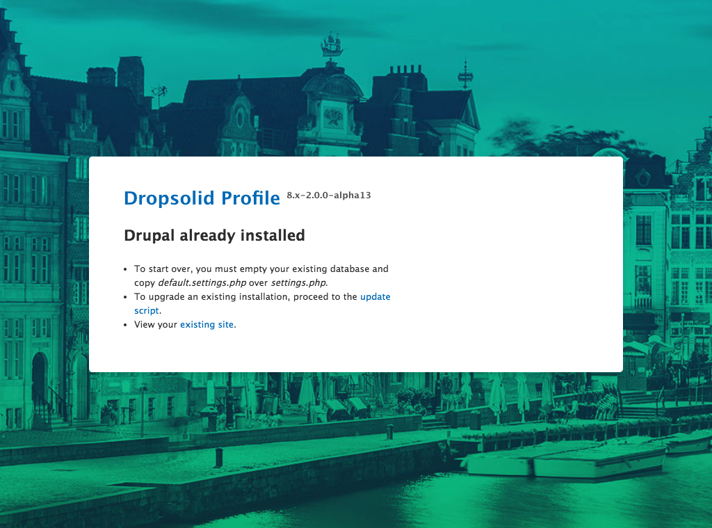

### step 1: Choose language

By default, it takes English. Even if you're building a single language site 
in Dutch, it is best to set everything up in English and add Dutch as an 
additional language. If nothing else, your non-Dutch speaking colleagues will 
thank you for it!

_(DO NOT SWITCH THE DEFAULT LANGUAGE LATER ON! After the site is developed 
and ready for the client, you will need to hide the English language **but for
the love of all that is holy**, do not try to change the default language. Use 
the disable_language module to simply disable English, WITHOUT CHANGING ITS
DEFAULT STATUS)_

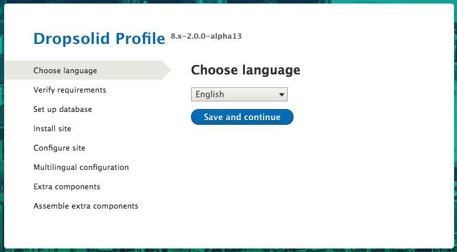

### step 2: Verify requirements

Fix any errors or warnings that come up

### step 3: Set up database

You normally won't land on this screen.

### step 4: Install site

you can follow the progress of Drupal going through the installation.

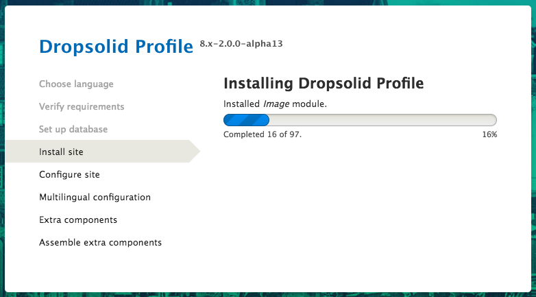

### step 5: Configure site

Fill in the form where needed:
- replace with the client's email address if you already have one

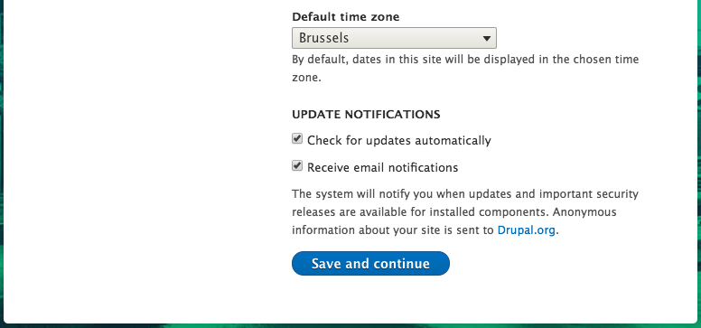

Important note (this is mentioned during the step as well): User 1 will receive
a random password. Our preferred flow is to only log in as User 1 using drush.

### step 6: Multilingual configuration

Rocketship is set up as multilingual by default. The required modules are 
always enabled, and all that's required at any point in time is to just enable
an extra language.

If you already know what languages you will use for this site, set them up now.
This will place the language switcher block in the correct region.

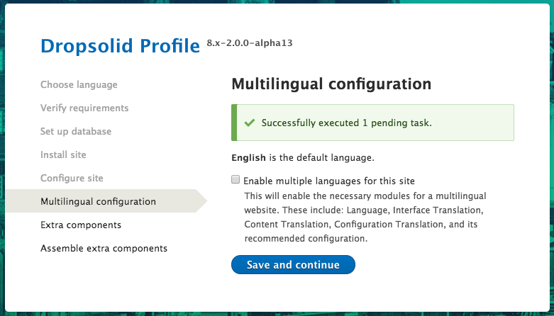

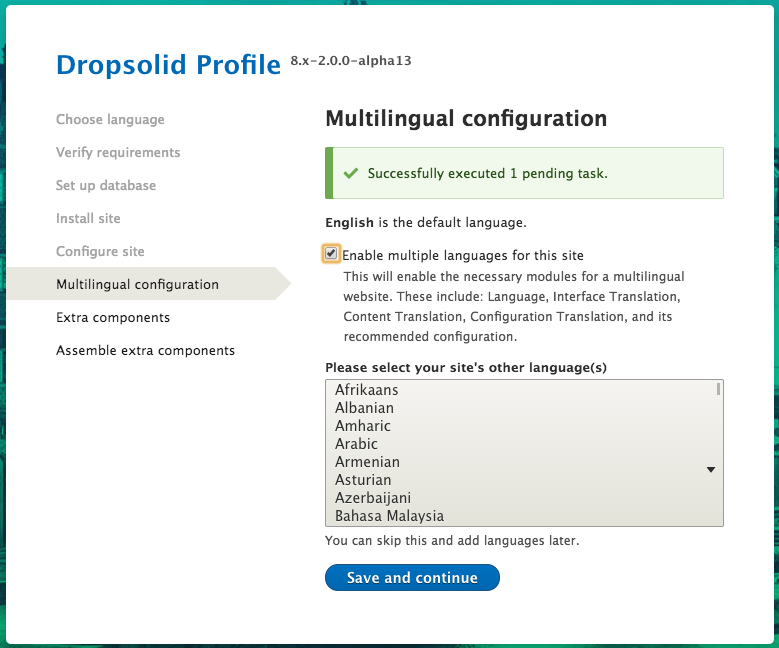

### step 7: Extra components

Here you can select any extra components. This includes our pre-made features,
and the option to select what theme to use.

For Dropsolid internal use:

At the very least, you can add these settings to get started:

- **Blocks**: Core, this will give you a custom block type to start with
- **Cookie policy**: Core + Demo. If the client paid for it, you can install a
cookie warning and this will generate a dummy page with the policy
- **Core**: Core + Content. That way you have a dummy homepage, 404 and 403 
to start from
- **Page**: Every site needs to be able to use pages
- **SEO**: Every site needs a way to manage SEO stuff like metatags
- **Theme**: Flex or Starter, depending on if it's a 'flex' project or custom.

Additionally, you need to check what **Features** are sold (eg. Blog) and
enable their 'Basic' or 'Advanced' (aka. Complex) versions.
'Basic' installs all the core feature stuff + makes an overview page.
_Note: For **Flex** sites, every site needs overview pages, so you will never
only install the 'Core' of a feature. It will always be 'Basic' or 'Advanced'_

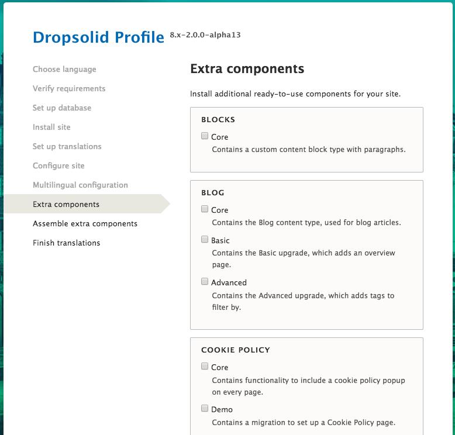

### step 8: Assemble extra components

This will take a while. See the progress on the installation of the extra 
components.

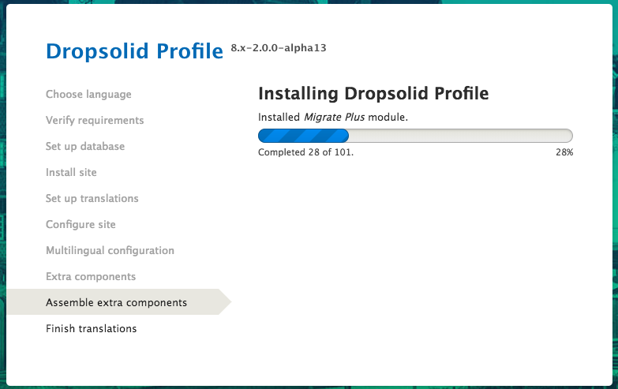

### step 9: Finish translations

Rest of the translation stuff getting done, more waiting…

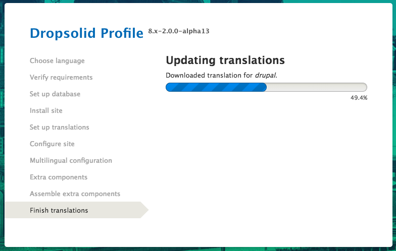

### (Almost) done

Before you can be finished, you have to set up the config split. This is
done using `../vendor/bin/drush d-set`.

For this to work, make sure the following folders are writable:

- config/sync
- config/splits/local
- config/splits/dev
- config/splits/staging
- config/splits/live
- config/splits/whitelist

Read more about this in the 
**[Configuration Management](../after-install/#configuration-management) 
section**

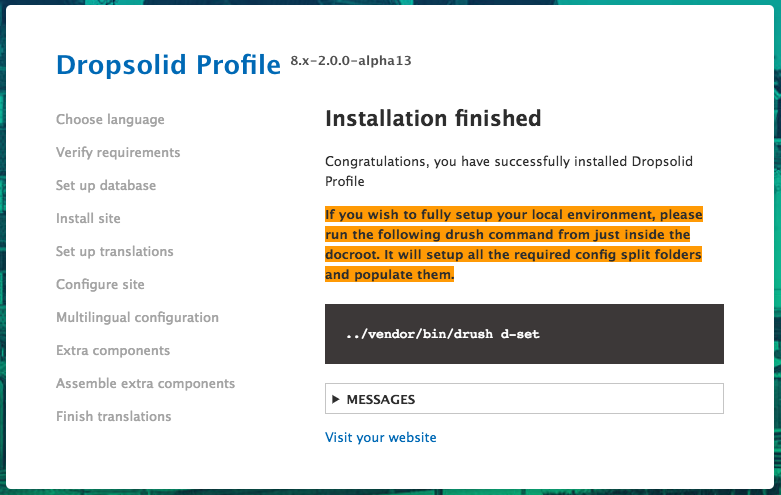

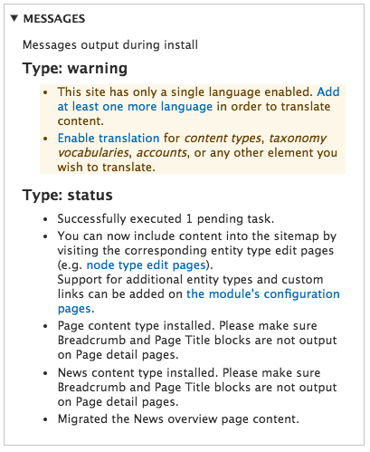

## Via drush

This can all be reduced to one drush command:

For example:
- default language English
- additional languages fr and nl
- extra components (enable theme or module):
  - theme: Starter
  - module: dropsolid block
  - module: cookie policy (with demo content in it)
  - module: demo content (404, 403, homepage, …)
  - feature module: blog basic

`../vendor/bin/drush site-install dropsolid_rocketship_profile --locale=en 
--language=en --strict=0  
dropsolid_rocketship_profile_multilingual_configuration.enable_multilingual=1 
dropsolid_rocketship_profile_multilingual_configuration.multilingual_languages.nl=nl 
dropsolid_rocketship_profile_multilingual_configuration.multilingual_languages.fr=fr 
dropsolid_rocketship_profile_extra_components.theme=dropsolid_starter 
dropsolid_rocketship_profile_extra_components.dropsolid_blocks=1 
dropsolid_rocketship_profile_extra_components.dcp_demo=1 
dropsolid_rocketship_profile_extra_components.rocketship_content=1 
dropsolid_rocketship_profile_extra_components.dropsolid_blog_basic=1 -y`
