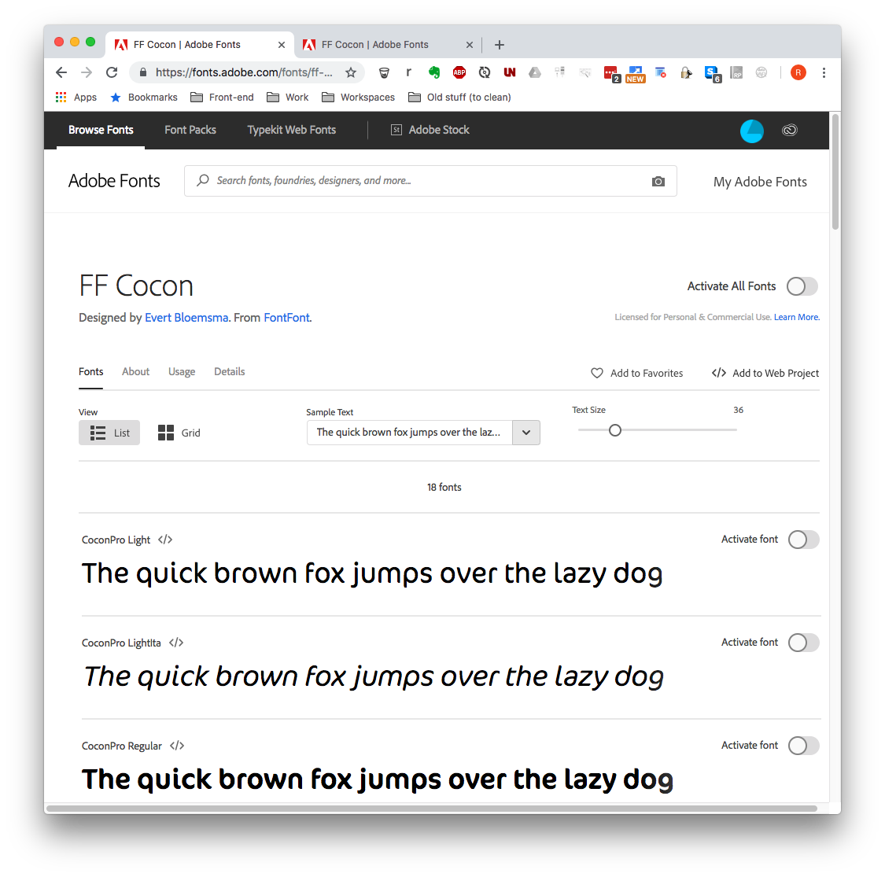
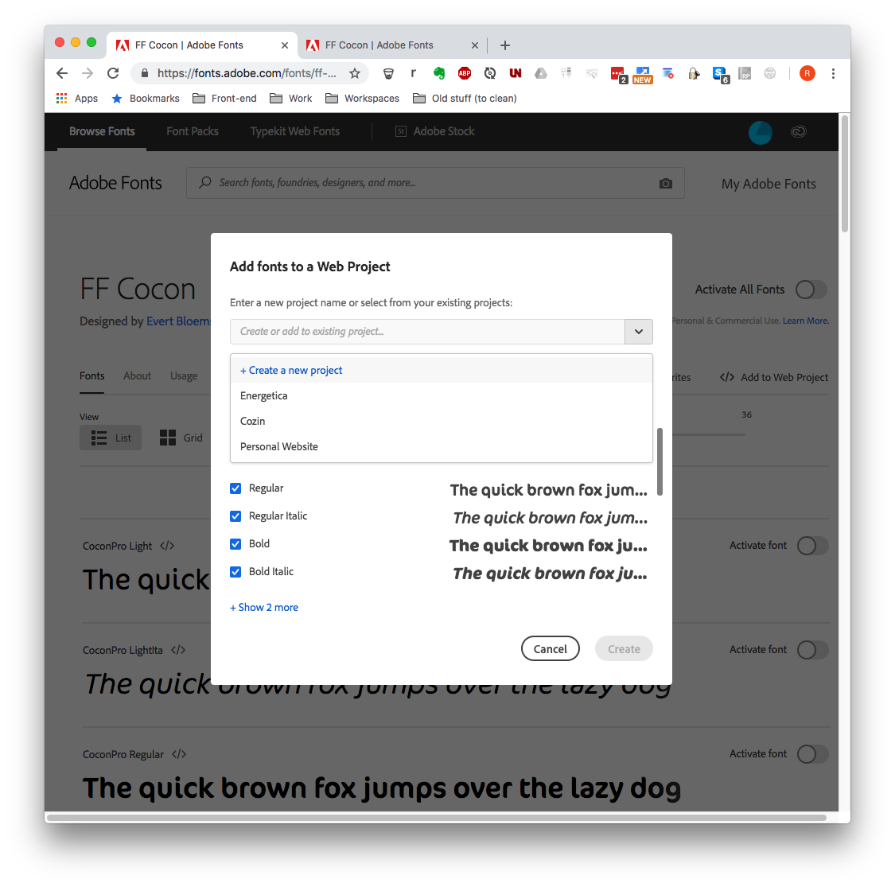
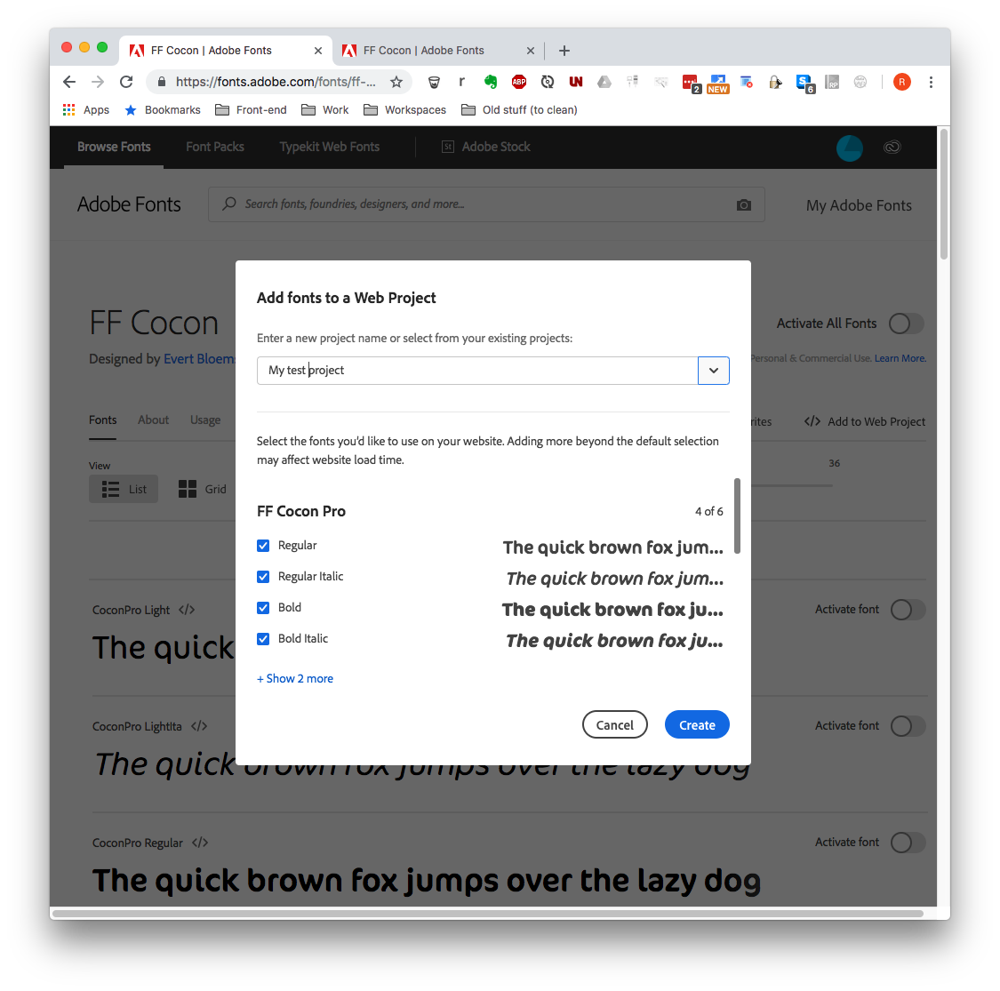
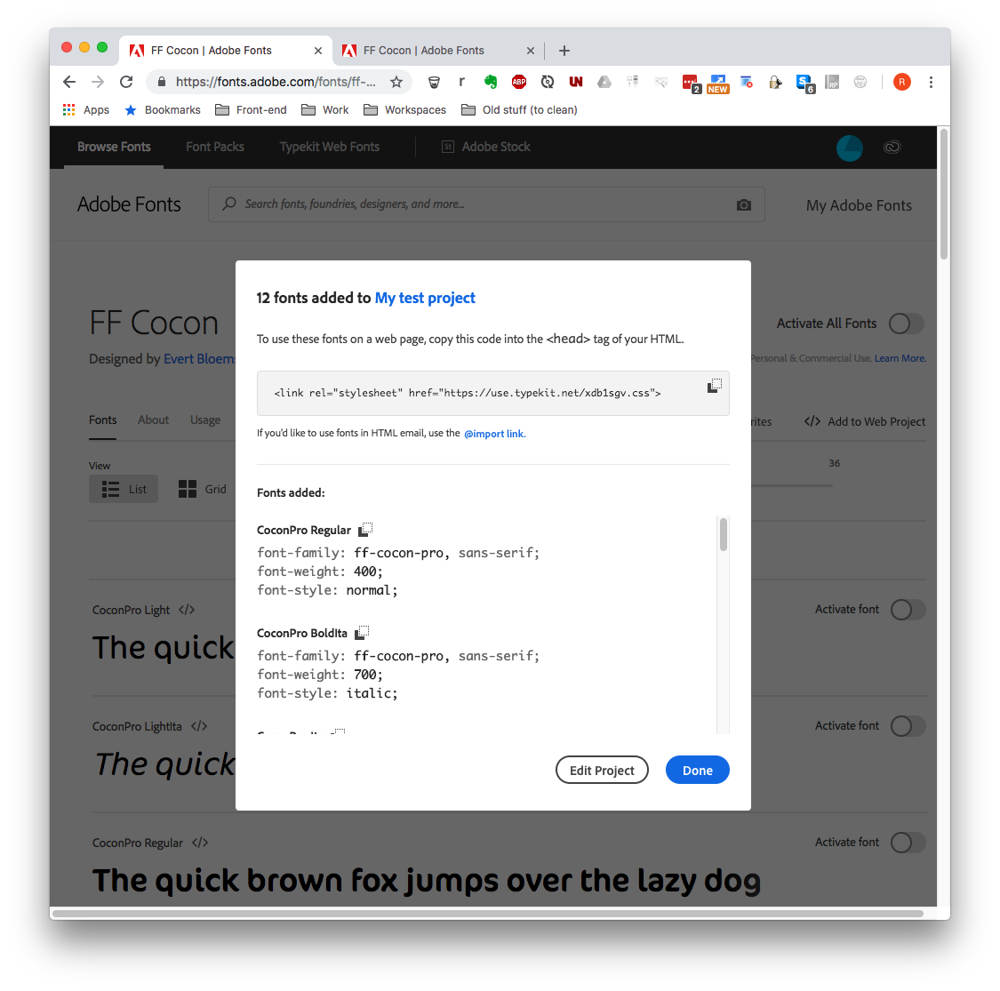
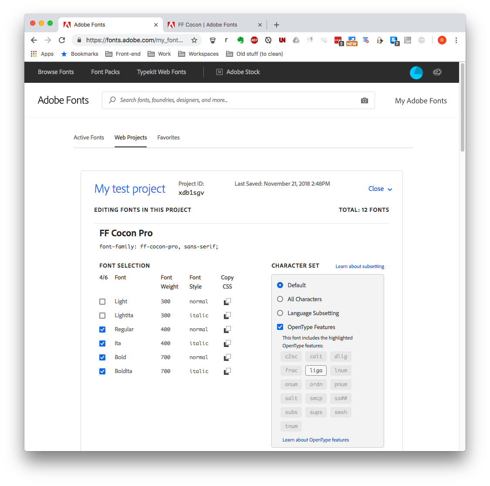

# Theming- [Theming](#theming)

- [Theming- Theming](#theming--theming)
    - [Technology](#technology)
    - [Debugging](#debugging)
    - [Available themes](#available-themes)
    - [Anatomy of child theme](#anatomy-of-child-theme)
        - [dropsold_THEMENAME.theme](#dropsold_themenametheme)
        - [YML](#yml)
        - [Components](#components)
        - [Scripts](#scripts)
        - [Config](#config)
        - [Gulp](#gulp)
        - [Twig](#twig)
        - [Sass](#sass)
        - [JS](#js)
        - [Fonts](#fonts)
    - [Styleguide](#styleguide)
    - [Breakpoints](#breakpoints)
    - [Special components](#special-components)
        - [Forms](#forms)
        - [Header & navigation](#header--navigation)
    - [Layout 01: Twig](#layout-01-twig)
        - [Example: Homepage](#example-homepage)
        - [Example: Blog complex](#example-blog-complex)
    - [Layout 02: CSS](#layout-02-css)
        - [Vertical rhythm](#vertical-rhythm)
        - [Horizontal space](#horizontal-space)
        - [Positioning layers](#positioning-layers)
        - [Grids](#grids)
    - [Features](#features)
        - [Page Manager](#page-manager)
        - [Overviews](#overviews)
        - [Details](#details)
        - [Libraries & styling](#libraries--styling)
    - [Paragraphs](#paragraphs)
        - [Background color & image](#background-color--image)
        - [Libraries & styling](#libraries--styling)
    - [CKE](#cke)
    - [Sources](#sources)

## Warnings

1. Before you do anything else, uninstall the child theme you are NOT using.  
Having both child themes installed, seems to break some inherited functionality 
(at least it dit in Drupal 8.5)  
2. Don't update the themes once you've started theming, you will lose your 
changes (unless pushed to Git)

## More info about the  theming

Consult the Readme file of the theme you are working with,  
it should contain more practical information about theming (fonts, gulp, …).

## Technology

- **Gulp** is used as a task manager (eg. compile CSS, make favicons, …)
- **npm** is used to manager the node modules for Gulp, and if needed, run 
pre or post scripts (see package.json)
- **Sass** + linting is used to write better CSS.
- **JS & jQuery**: used for all manner of interactivity, such as the mobile 
navigation.
 The base theme replaces the default jQuery version in the front-end with 3.3.x
- **Modernizer**: Useful for feature-detection (css or js properties support in
order to load fallbacks). The base theme replaces the default with version 3.6.x
and loads it for anonymous users as well.

## Debugging

You can add your own development settings to `sites/environments/local.services.yml`.  
This file is linked from within `etc/drupal/additional_settings.local.php` 
because the default development.services.yml gets overwritten when composer 
update is run.

Recommended settings:

<pre>twig.config:
    debug: true
    auto_reload: true
    cache: false #might not actually work, there's something funky with cache and twig
</pre>

- If you are using PHPStorm and have set up xdebug, installing `twig_xdebug` 
module makes it easy to debug twig templates.
- Using `twig_vardumper` + `vardumper` modules, is the easiest way to spy on 
twig content and variables. This will let you print twig stuff in the template
, in a cleaner and more readable way than kint or dpm will.  
- Trying to dump variables using devel or dpm, might actually break your site 
trying to load all that Drupal data. So avoid using it
- If you do need to use kint for some reason, make sure 'devel kint' is 
installed.

## Available themes

At point of writing, We have 2 child themes:
- `Starter` (for Solutions projects)
- `Flex` (for Flex projects)

Both of these are children of the `Base` theme, which means they can inherit a 
bunch of stuff such as theme functions, layouts, libraries, …

Some things, however, can not be inherrited or create extra complexity when we 
try to do so. For that reason, you will see a lot of the same 
files/folders/code in Starter as well as Flex. In order to avoid writing 
duplicate code as much as possible, we're actually storing most code in the 
parent Base theme and copying it over to the child themes on install.  
Composer (or npm, depending on your version) runs a couple of scripts located in
`yourtheme/scripts` in order to accomplish this.

In future versions, we will bypass these scripts entirely and the themes will be
 generated instead. Maybe even without the need for a parent theme.

This means: if you have suggestions for changes, or you see errors, DO NOT 
implement them in the Starter or Flex repo's but make a ticket for R&D. 
Otherwise you might add code that should be located in the parent theme or 
other repo.

Some folders/files that ARE unique for the child themes:

- `_components-override`: you can ignore this folder (only present in Flex at 
the moment). These files are copied to the `components` on install
- `*.yml`: the theme yml files, containing theme info, libraries, layouts, …
- `*.theme`: the theme functions
- `composer.json`: mainly used for installing the npm modules we need to 
compile CSS, JS, …
- `README`: info on the child theme + links

## Anatomy of child theme

- .theme file
- yml-files
- components folder
- components overrides
- scripts
- config
- gulp
- css and js
- fonts, images, favicons, icons, …

### dropsolid_THEMENAME.theme

Various theme functions (hooks). The most important ones being to:

- **Add theme settings:** `HOOK_form_system_theme_settings_alter` and 
`HOOK_preprocess_page`
  Theme settings are defined and saved in drupal settings so they are 
  available in your JS files (using the drupalSettings object) and in your 
  theme's settings page. An example of this being used, would be the language 
  menu and fixed header (Flex only).
- **Add background-colors for paragraphs:**  
  `_rocketship_paragraphs_bg_color_options_list`  
  This is where you need to add the extra colors that the simple header and 
  other paragraphs use.  
  Works with `00-theme/admin.style.scss` to build the preview in the form 
  display.
- **Load libraries:**  
  `HOOK_preprocess_page`  
  For conditionally loading libraries. DO NOT LOAD ALL YOUR LIBRARIES HERE!!! 
  Only for exeptional cases. Eg. loading the feature libraries happens here.

Don't forget that the child theme inherits theme functions defined in the 
parent 'Base' theme.

Eg. for turning responsive tables on or off (selectively):  
`$variables['table']['#responsive'] = FALSE;`

But also, html viewport settings, classes on body-tag, various block classes, 
theme suggestions, …

### YML

- **info:**  
  - Aliasses: These are used in Twig when you need to include another file. 
  Makes it really easy to simplify a path so you don't need to change it in 
  a 100 different places if something is renamed
  - global libraries: libraries that are used (almost) everywhere
  - requirements: the modules this theme depends on
  - regions: regions made available for block layout. Beware there are several 
  locations to put you navigations in. **Primary and secondary nav are bundled 
  together in the mobile navigation.** The rest is not.

- **libraries:**  
  - bundles of js (and sometimes css as well). Don't forget you still need to 
  attach these to your theme if you want to use them. Either in *.info, in 
  *.theme or in a twig file

- **layouts:**  
  Templates for Page Manager and Display Suite. At least 1 template in here: 
  custom frontpage for Page Manager.  
  Other templates you find in Page Manager and Display Suite dropdowns, are 
  inherited from the rocketship_core module and should be used instead of 
  default templates

- **breakpoints:**
We mostly use the breakpoints defined in dropsolid_core. These should be the 
same ones

### Components

The themes are built using a component-based (or Atomic) method.  
Before going further, it is recommended you get familiar with the idea and 
practice behind this. To do so, here are some resources:

- http://bradfrost.com/blog/post/atomic-web-design/
  - More in depth: http://atomicdesign.bradfrost.com/chapter-2/
- Implementation example: https://patternlab.io/
  - Demo: http://demo.patternlab.io/

Our method is slightly different (eg. in order to try and avoid naming 
confusion with D8)

First, a distinction about what the components are used for:

- 00-theme
- 01-paragraphs
- 02-features

Inside that is the atomic structure:

- **base**: config and vars
- **atoms**: simplest elements, eg. fields
- **molecules**: groups of atoms, eg. most blocks
- **organisms**: groups of molecules, eg. paragraphs or site regions
- **pages**: Drupal pages + our html frame. This is also where we add the font, 
because it works with JS in the HEAD of the HTML
- **layouts**: custom DS and Panel layout templates

All of these offer a **combination** of twig, js and css-files.  
The reason you will not find a lot of CSS here, is because of the complexity 
of our Sass. There are lots of imports (dependencies) and cascades that are 
easy to break if we start splitting the CSS.  
We do split off the CSS for the Features and Paragraphs from the rest of the 
theme.

**Naming** is important for our structure. Sometimes we use numbered folders, 
in order to control the loading order. Files starting with and underscore (_) 
indicate that they are imported or included somewhere.

**In the future**, there will be integration of an atomic styleguide 
(like [Pattern Lab](http://demo.patternlab.io/)). But for now you can find a 
drupal **styleguide** in `admin/appearance/styleguide`

### Scripts

Don't touch these. They are for development and theme generation purposes only.  
Using the clear-scripts WILL remove ALL your theming!

### Config

This is where default values are defined for the theme functions created in 
THEMENAME.theme. You don't need to touch these

### Gulp

We use Gulp as our task manager. This will compile all the things we need to 
make the front-end work.

#### + Browser sync

First of all: if you work with launchpad, gulp will use Browsersync to 
automagically update your browser when you change your Sass or JS  
This requires you to pass 2 arguments to your gulp tasks:
- projectUrl: a string, the url of your project, including http(s) and the port!
- projectDelay: a boolean, default is FALSE,  if you have a slow sync, you'll 
have to tell the system to wait and reload again after the sync has finished.

Example:
`gulp --projectUrl http://rocketshipdemoflex.docker.localhost:81/ --projectDelay`

Your browser will use localhost:3000 to render the site and keep listening to 
updates.  
It wil **NOT** work if you go to your default project url.

**Extra options:**
If you change the port to 3001, you will get extra development options.
Eg.
- sync across devices: you also get a proxy url so you can surf to your 
machine with any device. Very handy if you want to debug on Android or iPhone

#### + Tasks

Knowing this, you can now use gulp with any of the following tasks.
Enter `gulp` followed by one of the following task names:

**The basic commands:**

- `dev`: same as the default task, this will compile CSS and JS for development 
(with linting), try to create favicon and trigger a 'watch' task. 90% of the 
time, you only need this task.
- `prod`: compile CSS and JS for production (no map files nor linting nor watch)
- `watch`: included in ‘default’, this task will keep running in the background 
to keep compiling the Sass, JS and images
- `favicon`: This will generate the favicons (if you place an image in 
/favicons/source folder).  <b>Don't forget to add these images!!!</b>

**What is running in the back of these:**

- `setup`: included in ‘default’, this will check for the favicons but also 
try to provide a copy of Fontawesome locally. Please use a CDN for fontawesome 
though. This should already be active in html.tpl.php
- `css:dev` and `css:prod`: this will compile the Sass (inside a component 
folder) to CSS (and provide sourcemaps if dev is used). The produced files end 
up in the `css`-folder
- `js:dev` and `js:prod`: this will concatinate any JS-files inside a 
component folder (and provide sourcemaps if dev is used). The produced files 
are located in the `js/min`-folder
- `css:mail`: runs after the css-task, produces css from the style.mail.scss 
file
- `css:editor`: runs after the css-task, produces css from the 
style.editor.scss file
- `js:lint`: included in ‘js:dev’, this will provide notes for you to write 
better code
- `css:lint`: included in ‘css:dev’, the same but for Sass
- `critical`: not currently included, this will help generate a file with 
'critical' css for a certain site path. Currently not used but you could use 
the produced file to put inline, in the HEAD of your site.
Needs some setup in order to use (see task)

**The extras:**

- `icons:font`: not included in ‘default’, using gulp iconfont this will 
generate a font based on svg’s in the 'icons' folder. It will also add 
mixins to use them.
- `icons:sprite`: not included in ‘default’, using gulp sprite this will 
generate a sprite based on svg’s in the 'icons' folder. It will also add sass 
variables and mixins to use the
- `fonts:inline`: Currently not in use. This will attempt to convert all fonts 
called using @font-face in style.fonts.css into Base64 and include it into the 
css. Can be useful if you absolutely need the fonts to load with the CSS. But 
usually you want to avoid using this. Especially since we use a js-solutions 
to load fonts.

#### Compile Sass/JS

To simply watch and compile your Sass/JS, you must navigate to your theme 
folder (*/docroot/sites/all/themes/custom/dropsolid_base/[child-theme]*) in 
your command line and run `gulp`.

#### Favicon Generator

This theme has an automatic favicon generator. Do create your favicons, 
add a png to the favicons source folder 
(*/docroot/sites/all/themes/custom/dropsolid_base/[child-theme]/favicons/source*). 
This png must be at least 250x250 px and a square format. In your command 
line, run `gulp favicon` to generate the favicons in the generated folder 
(*/docroot/sites/all/themes/custom/dropsolid_base/[child-theme]/favicons/generated*). 
You don't have to add these generated favicons manually, there's a function 
in template.php that takes care of that for you. Don't move the favicons out 
of the generated folder!

#### Custom icon-font or sprite Generator

This theme also has an automatic icon-font generator. Add the svg's to the 
icons folder (*/docroot/sites/all/themes/dropsolid_base/icons*) and in your 
command line run `gulp icons:font`. This will generate a custom icon-font 
in your fonts folder, that you can use in your Sass files.
This will also produce relevant variables and mixins in the components base 
folder for you to use to add these icons in your css.
Another option, is to use `gulp icons:sprite`, if you want to use the sprite 
option instead of fonts.
Just like with the custom font, it will generate variables and mixins in the 
components base folder.

In order to make use of either option, you will need to change variables in:
`components/00-theme/00-base/00-config/00-variables/_vars-base.scss `

#### Critical

(Currently not in use)

You'll have to add subtasks per path you want to render critical CSS for.
Make sure these pages have content in them, otherwise it's pretty pointless.
Also, the critical CSS files are useless if you don't inline it in the HEAD 
of your site. Probably best to use something like AdvAgg to do this.

If you need to inline it yourself, you can do so like this:
``

#### fonts:inline

You probably won't need this. It's for extreme cases where you really need to 
have your font loading alongside the CSS. But since we use a JS-solution, it's 
probably not a good idea.

### Twig

Twig is a powerful templating engine, which allow us to write html around the 
Drupal data in an easy way.  
Some of the things you use are:
- [**filters**](https://twig.symfony.com/doc/2.x/): so you can manipulate 
strings (eg. translate, find/replace stuff, make lowercase, …), split arrays, …
- [**include**](https://twig.symfony.com/doc/2.x/tags/include.html): include a 
twig file inside another one + pass variables to it using `with {}`
- [**extends**](https://twig.symfony.com/doc/2.x/tags/extends.html): override 
blocks from a master template
- [**embed**](https://twig.symfony.com/doc/2.x/tags/embed.html): combines both 
include and extends
- [**macro**](https://twig.symfony.com/doc/2.x/tags/macro.html): kind of like 
a function. You reference a macro and pass variables to it.

For Drupal's theme suggestions to work, it needs to have its templates located 
in a folder called `templates`. For this reason, we put all our suggested 
.html.twig files inside its own `_drupal/templates`-folders BUT do an 
`@include` to whatever twig file we control the naming of.

The aliasses used with these includes, are defined in THEMENAME.theme. The 
make it easier to build a path.  
Combine this with underscores and clear naming for better readability and use 
in future pattern styleguide.

There are also some extra twig functions, most notably a BEM function.  
This lets you create classes following the BEM-structure for better writing of 
CSS (extended Twig-function, thanks to unified twig module)

**Examples:**
- `components/example` naming, embed, aliasses, BEM, …
- `molecules/menus/menu` for include/embed, macro, BEM, …

### Sass

As mentioned before, the styling is combined in the components folder with the 
twig and JS. It is also split for Features, Paragraphs and Theme.

- 00-theme
- 01-paragraphs
- 02-features

And inside each of those:

- **base**: config and vars
- **atoms**: styling the simplest elements, eg. fields
- **molecules**: styling groups of atoms, eg. most blocks
- **organisms**: styling groups of molecules, eg. paragraphs or site regions
- **pages**: styling Drupal pages (eg. 404, user, maintenance, …)
- **layouts**: styling for custom layout templates

All theme files combine into style files (with @import) for specidic perposes: 
admin, editor, fonts, mail, print, …

Only compiled CSS-files loaded in a library (eg. in .info file, a hook or a 
twig-file)

### JS

Folowing the same atomic structure, you will find javascript files for 
specific functionality added to specific components. Most of these are **loaded 
selectively**.  
Eg. language menu JS is set in `molecules/links/links--language` (makes a 
dropdown menu or shortcodes) or dropdown menu and mobile menu JS is set in 
`molecules/menus/menu`).

There are also 2 special JS files, located inside `00-base`, these give you 
some helper functions and global functionality. These are **loaded globally**, 
alongside jQuery, jQuery Once, drupal JS, drupalSettings, ….

All js-files located in the atoms/molecules/organisms/… folders will compile 
into `js/min`.

If you make a new component:
1. add your original files to your new component's folder
2. include the minified file and not the original source to your library
3. don't forget to add your dependencies (eg. jQuery, …). Even if it is already 
added globally, this makes sure they are loaded BEFORE your JS is run
4. attach your library to your component's twig-file if possible. If you don't 
have a relevant twig-file to add it to, there are other ways to load the libary 
(see previously in the readme)

!!! DO NOT ADD YOUR JS-FILES TO THE 00-BASE FOLDER !!!

**Namespaces:**  
We use a namespace (basically a global variable) to save all our functions in. 
This is to make sure that we can easily reference functions/variables defined 
in a separate file and make such references readable. This would not be a big 
problem with aggregated files but would be during development.  
See the various JS-files to see what I'm talking about.

**Behaviors**  
Drupal behaviors are great. Look them up sometime.  
Bundle your js triggers inside a behavior to ensure they are loaded after Ajax 
calls.  
You can split off your actual JS functions and put them outside the behaviors.

**Bigpipe**  
There is a link to documentation about Bigpipe in the Sources at the end. In 
short: Bigpipe is a system that loads chunks of the drupal site separately for 
better loading efficiency. The language navigation is one of those elements 
that is handled by Ajax in that way. That's why you don't see the active class 
or property printed out in the Twig file.

**jQuery Once**  
Examples of how to use this are in the top comments of all JS files.  
These help to avoid loading JS (eg. event handlers) multiple times.

**WARNINGS:**  

- There is a bug in Drupal 8.6 that breaks the 'context' property when you try 
to get an element, in a library that is not loaded globally in your info file.
E.g. `$('.myclass', context)` gives back an empty object (length 0), but 
`$('.myclass')` works.

### Fonts

We use Google/Webkit's font loader in order to render non-blocking fonts. This 
is done using a bit of JS included in the HEAD of your site.

**Setup:**

- `fonts`-folder to contain your font-files, if not using google fonts or 
typekit
- `00-base/02-fonts`: reference your font files, if not using google fonts 
or typekit
- `00-base/00-config/_vars-01-typo.scss`: variables for your font family names
- `01-atoms/_00-normalize.scss`: style a preloader if you want. By default it 
is turned off. By turning it on, your page fades in after fonts are done 
loading.
- `04-pages/html/_html.twig`: settings for google/webkit/custom webfonts. 
Fontawesome is already included, add custom iconfont here as well, if you have 
one

## Styleguide

As mentioned before, there will be integration of an atomic styleguide at some 
point. For now you can find a drupal styleguide in `admin/appearance/styleguide`

This uses the `styleguide` contrib module as a starting point and with a 
custom module, we take over the page and generate our own elements in the 
order and groups we want them.

Using this, you should be able to style most of the atoms and part of the 
molecules (eg. pager).

## Breakpoints

Breakpoints are set and used in 3 places:
- **in the theme (and dropsolid_core)**  
  `breakpoints.yml`-files:  
  These are used for responsive image styles by Drupal
- **in the Sass**  
  `00-theme/00-base/02-helpers/02-mixins/_mixins-00-breakpoints.scss`  
  `00-theme/00-base/00-config/00-variables/_vars-breakpoints.scss`  
  You get a lot of possible breakpoints here but the most important thing to 
  remember, is that we work from the 'mobile first' principle.  
  **Meaning**: most breakpoints go from smaller to bigger screens using 
  'min-width'.  
  **However**, there are exceptions: we have breakpoints to add styling 
  specific for a certain breakpoint (eg. bp-xs-only is only small phones) 
  OR smaller than a max-width (eg. bp-sm-only is for screens smaller then or 
  equal to tablet).  
  **Why do we have those exceptions?** Because sometimes a mobile design is 
  very different from the bigger screens (eg. mobile menu and navigation) and 
  we don't want to have to undo a bunch of styling.

- **in the JS**  
  `00-base/06-scripts/00-helpers.js`  
  There is a `self.screen` variable set up so you can check on which breakpoint 
  you are. This is used by the JS that does the mobile menu navigation but can 
  come in handy in other places as well.  
  It relies on the getBreakpoint and checkScreensize functions, which refer to 
  a pseudo-element set by CSS.

## Special components

### Forms

We use floating labels in the forms.  
`_forms--helpers.scss` defines the styling in mixins, either on a group of 
labels or individual label.  
`_forms.scss` calls the mixins for groups of labels in specific forms, or 
individual labels.  
`forms.js` builds classes for the styling to work, on user interaction.  

We also mark fields as being 'optional' instead of marking the ones that are 
'required'. The styling and twig for this element is located in the 
`form-label`-folder.  
If you need to replace with 'required' fields, you can remove that element in 
the Twig-file or hide it in the Sass, and style the other element instead.

### Header & navigation

The header can get quite complex, with several menu's and blocks added to it. 
Especially because the mobile navigation can include different elements than 
the bigger menu and certain blocks need to be displayed in different places 
depending on the breakpoint.

**Add your blocks and menu's to the right regions:**

- **header_top**: blocks and stuff that goes in a bar above the primary header 
& logo. Eg. language switcher, contact info or social media icons
- **top navigation**: menu's that are in the header top (so above the prim. 
header)
- **primary header**: usually only the logo (branding block) is in here. Unless 
you need some blocks besides whatever is in the navigation.
- **nav primary and nav secondary**: these 2 regions are used to build the 2 
possible navigations that go next to or under the logo in the header. Those 2 
are grouped into the 'site-nav' (twig files) and 'mobile navigation' (concept). 
So anything in those regions is visible in the open mobile menu. Eg. the 
primary and main menu's + any CTA blocks next to it. Also social media icons 
that are visible on mobile but not desktop.

As you can read, we have some specialized groupings in place for building the 
elements of the header and navigation. Of course these all need to be styled 
in the right place as well.

**Be careful to add your styling to the right files:**

- styling the search block: molecules/search/search-block
- styling the other blocks: molecules/whateverblock
- styling the menu's that go inside the navigation: molecules/menus/menu
- styling the header logo: molecules/site/logo
- positioning the elements of the navigation (menu's + blocks): 
organisms/site-nav
- positioning the elements in the header (logo + several wrappers): 
organisms/site/site-header

As mentioned in the `breakpoints`-section, the navigation uses breakpoints in 
order to make a mobile navigation and a bigger navigation.  
We also use several block layout regions to group elements from the header and 
navigations in a way that works for mobile as well as wider screens

## Layout 01: Twig

Look at a drupal site as 4 nested dolls:

- **block layout**: the main frame of our site. These contain all the regions 
set in the Drupal html twig file
- **panels**: the sub-regions that go inside the 'Content' block layout region. 
You can make layout templates and define those sub-regions using 
**Page Manager**. You can do so for different types of pages (eg. for different 
content types like Landing Page, Blog detail, …)
- **view-modes**: the sub-regions that go into the main content of a content 
type/block/paragraph. You can make layout templates and define those 
sub-regions in that element's `manage view modes` tab and this uses 
**Display Suite**. You can also make groups here (html-tag with optional 
classes).
- **theme twig files**: all entities (fields, blocks, ct's, paragraphs, …) 
have corresponsing Twig-files (you can see their names and paths when theme 
suggestions are visible in html). The twig-files for view modes (only in blocks, 
ct's and paragraphs) can be overridden with Display Suite layout templates.

**Fields:**

field don't HAVE view-modes, they are rendered INSIDE view modes. You do have 
some tricks to change their output without dealing with Twig though. Look at the 
formatters and options in the various view modes. Formatters can also be custom 
made, but that's back-end dev stuff and outside the scope of this documentation.

**DS vs default twig files:**

So for blocks/ct's/paragraphs, you have a choice to either use the default twig 
templates and have full control of the output inside those (no predefined 
subregions, no UI to help you). Or you can avoid this manual work by using 
Display Suite layout templates where sub-regions can be pre-defined and groups 
made in the UI of 'manage view modes'. For Flex projects, it is recommended to 
use the provided Display Suite layouts and their regions, in combination with 
groups.

**Naming files:**

When making your own layout templates, keep in mind that **the machine name 
has to be the same as the twig file name**. The machine name uses underscores 
(_), the twig file uses dashes (-).

### Example: Homepage

Our pages use Page Manager to build up a frame and regions to output node 
content. For the homepage, a default 'frontpage' template is used (coming from 
rocketship_core).  
However, you need to have full control of the regions and we don't want you to 
modify rocketship_core templates. So we have prepared a custom layout for you 
to modify and use.

- `00-theme/05-layouts`: where the custom frontpage layout template is located. 
Add your regions and html here.
- `THEMENAME.layouts.yml`: The regions are defined here
- `structure > pages > edit node view > homepage > Layout`: in the dropdown 
find 'Dropsolid THEMENAME layouts - Panels' and choose 'THEMENAME frontpage' 
and save it. Then go into `Layout Regions` to re-assign the content. Update and 
save

### Example: Blog complex

You will see that most contenttypes have 3 view-modes they use:
- teaser: for the main overview
- full content: for the node detail content
- header: for the node detail header

Why a split between header and full content? Because some CT's have complex 
headers that contain a multitude of fields and options (eg. News and Blog) and 
this works better for building the layout.  
This split is reflected in the Page Manager layouts: you will see that those 
layouts load header and full content separately into separate panel regions.

As for the view mode layouts themselves, if you go into the Blog header, you 
will see a display suite layout with regions in columns and also groups to 
bundle tags with other meta info.

## Layout 02: CSS

### Vertical rhythm

In order to set up consistent vertical space (vertical rhythm) and horizontal 
spacing, the theme contains several variables in 
`00-theme/00-base/00-config/00-variables/_vars-01-layout.scss`  
You can tweak these if you need, but keep in mind they are part of a system 
used throughout the whole site to make your life easier. If you just need 1 
element to have a different amount of spacing (eg. the homepage blocks and 
rows), please just use another variable in those elements.

- `$gap-vert` is based on the line-height, because this will make space in 
texts (eg paragraphs and lists). Therefor, it is based on the typography 
sizing. It's the basis used in print design for ensuring readability and a 
nice vertical rhythm.  
- `$gap-vert-xs` `$gap-vert-sm`: these are 2 smaller variants of this, used 
when less space is needed. Eg. with small titles or other smaller bits of text. 
The reason these have a fixed size, is because you can't set a minimum margin 
or padding size, so we had to settle for a fixed value instead. So you might 
need to tweak these a bit based on how big your line-height is.
- `$gap-vert-lg`: The bigger gaps are still based on your typography

Besides those, we also have special top and bottom spaces, per breakpoint.  
These are used by almost all rows of content. Most notably all the paragraphs, 
headers, related views, …  
`$gap-vert-top-…` and `$gap-vert-bottom-…`

### Horizontal space

There is a default gap size defined, that is also the fallback for the grid 
system gaps between columns. Try to keep this value the same as in the designs.  
The container padding is half of the columns gap.

### Positioning layers

That layout variables file also contains a map of z-indexes you can use to 
keep overview of all the layers in your site. This is especially important
for the mobile menu and other overlays.  

!!!USE THE MIXIN AND THESE VARIABLES!!!

**Important!**

- Keep in mind that a z-index ONLY works on an element with a position 
(relative/absolute/fixed/…).
- Remember that if you nest layers, their z-index is always RELATIVE to the 
closest wrapper with a position.
- For these reasons, the `.container` and several other wrappers do not have a 
default position: relative. We want to avoid having to override these in the 
header.
- Resetting positioning on an element can always be done by giving it 
`position: static`. This makes the element ignore position, z-index, 
left/right/top/bottom.

### Grids

`00-theme/00-base/05-grid`  
We have a grid system in place that uses flexbox and has fallback stuff for IE.  
Inside this folder, you will find the mixins and examples using html.

You might also notice there is a `_alt` folder. This one contains a couple of 
experimental grid systems, using CSS Grid. Do not use this in production as 
long as IE is supported. The fallback system is complex and unstable.

### Fonts

#### Using typekit

In-depth explanation on how to use Typekit: 
https://redmine.dropsolid.com/issues/77684

For designs submitted by 3rd parties, a typekit project should be made by 
said party.
In the case of Dropsolid designs, it should be made by one of the Designers, 
with the company account.

All typekit info should be provided to the front-end development:
ID, the font name and font-weights, …
Basically, all info see on the last screenshot of the typekit project.

##### 1. Go to a font and click 'Add to Web Project' (top right)

##### 2. Give your project a name OR choose an existing project

##### 3. Click create and you will see some css output (which you don't need)

##### 4. Click 'Done' and you will end up on your project detail page
Here you will also see:
- the Webkit ID that the developer needs to get the font working
- the font-family name and weights you can use in CSS (use it in the 
_vars-00-typo.scss file):

##### 5. In your Rocketship theme, add the typekit ID to YOUR THEME/components/00-theme/04-pages/html/_html.twig

<pre>
{% include '@pages/html/_html--master.twig' with {

    body_classes: [
      logged_in ? 'user-logged-in',
      not root_path ? 'path-frontpage' : 'path-' ~ root_path|clean_class,
      node_type ? 'page-node-type-' ~ node_type|clean_class,
      db_offline ? 'db-offline',
    ],
    webfont_config_typekit_id: 'your_typekit_id_goes_here',
    webfont_config_google_families: [],
    webfont_config_custom_families: ['FontAwesome'],
    webfont_config_custom_urls: [base_path ~ directory ~ '/css/style.fonts.css'],
    safari_tab_color: '#33C3F1',
    tile_color: '#FFFFFF',
  }
%}

</pre>

You can now use the font-family and weights in your CSS

**However:**  
To add this font to your CKEditor CSS, you will need to copy the @import rule 
into style.editor.scss  
Eg: `@import url("https://use.typekit.net/your_typekit_id.css");`

Want to know more about Typekit and webfont loader?  
https://github.com/typekit/webfontloader

## Features

Explained in detail in earlier sections of the documentation. Important to know 
for theming, is that these create contenttypes which have view modes and panel 
pages with layout templates and classes for you to theme them.

The styling is located in a separate folder of the components: 02-features

### Page Manager

- Layout: where you can choose a template (as mentioned before when talking 
about the homepage)
- Layout Settings: you can add extrea classes (separated by a space), this is 
handy when making overview pages. It is used by the advanced product and job 
features.

### Overviews

By default, most overviews are built using the (Landing) Page content type 
and by placing a View into it (using the Overview paragraph).  
However, you can make a separate Page Manager page, specifically for the 
overview of a content type.

In that case, you would need to:
- Make a new (Landing) Page with your overview in it
  - Adding new overviews to the dropdown involves a bit of custom coding. 
  This should be covered in the 'development' part of the readme's. If not, 
  you can check any Feature module (eg. dropsolid_blog) for their 'basic' 
  .module file to see how it works. Either make a custom module, or add this 
  functionality in dropsolid_core for your content type views
- Find the node UUID for that page
  - surf to your page's devel page using /admin/content -> operations (dropdown)
  - go to tab Devel -> Render -> Variable to find & copy the UUID
- edit the node view in Page manager
- Add variant (top right)
- Use Type Panels, select context and Selection criteria
- Leave Context as-is
- Add a condition to the Selection criteria
  - pick Node UUID
  - fill in the UUID you copied earlier
- Save
- Drag your new variant ABOVE the Page variant so it gets picked by Drupal first

### Details

As mentioned before, the Page manager page for this loads the entity content's 
view modes 'header' and 'full content'.

### Libraries & styling

The Features and Paragraphs have libraries inside their modules, these contain 
functional JS (eg. FAQ paragraph needs to open and close with a click).  
They also load a structural CSS-file.

In future, we will look for a way to include the twig-templates and twig BEM 
function as well so they work fully without the dropsolid themes.

Right now, if you have a dropsolid theme enabled, each Feature and Paragraphs 
load a library in the theme's `THEMENAME.theme` file's `HOOK_preprocess_page` 
when their main module is enabled. The styling coming from the minified css 
files generated from `component/02-features` and `component/01-paragraphs` files

## Paragraphs

### Background color & image

- **THEMENAME.theme**:
  `HOOK_rocketship_paragraphs_bg_color_options_list`
  This is where you need to add the extra colors that the simple header 
  and other paragraphs use.
- `00-theme/admin.style.scss`
  add the colors for that options list in the admin area
- `components/01-paragraphs/03-organisms/_paragraphs.scss`
  define the background colors and related styling for the paragraphs
- `components/00-theme/03-organisms/00-page/page-header`
  define the background colors and related styling for the Simple Header, 
  as used in Page content type, Office, Product, …

### Libraries & styling

Same stuff as for the Features

## CKE

### Webfonts
In order to use Google (or Typekit) fonts in the editor, you will need to 
@import your font into `style.editor.scss`.  
This is because the admin-theme does not use Webfont loader at this point.

DO NOT USE @IMPORT IN THE FRONT-END THEME !!! Always use the webloader in 
04-pages/html/_html.twig for the front-end theme.

Example for using Open Sans and Roboto Condensed:
<code>@import url(https://fonts.googleapis.com/css?family=Open+Sans:300,400,700|Roboto+Condensed:400,700);
</code>

### Styles
Just like in D7, we can add Styles. This is done in the UI:
`/admin/config/content/formats`

For each of your editors, you can scroll to the Styles dropdown section 
and add your custom styles to it.  
Always start with a tag-name and add the class separated by a dot (.)  
For multiple variants, you can add all possible classes to your tag, separated 
by a pipe (|)  
There is a bug though. When you turn on 'limit html tags', the Styles dropdown 
breaks.

## Sources

- [Vardumper](https://www.drupal.org/project/twig_vardumper)
- [Twig xdebug](https://www.drupal.org/project/twig_xdebug)
- [Devel: webprofiler](https://www.drupal.org/project/devel)
- [FA features](https://docs.google.com/document/d/1JJLHBrf9HjFR0qNgCOMphM5oakNqfGLsRuan92sNp3A/edit?pli=1#heading=h.iytf5i9a7i74)
- [Status features](https://docs.google.com/spreadsheets/d/1s5Y9cr3M1tnI8cHe0B_gg4N8Zcl96ebi5okS9Jy4QmQ/edit#gid=0)
- [FA paragraphs](https://docs.google.com/document/d/11qOzG0PP0QRezln13RweRZ9KAyzsH4ZorqLwPbTaZ_0/edit?pli=1#heading=h.hhx2ta4hlilw)
- [Status paragraphs](https://docs.google.com/spreadsheets/d/1s5Y9cr3M1tnI8cHe0B_gg4N8Zcl96ebi5okS9Jy4QmQ/edit#gid=1366934568)
- [Atomic design](http://bradfrost.com/blog/post/atomic-web-design/)
- [Atomic design: book](http://atomicdesign.bradfrost.com/table-of-contents/)
- [Pattern lab demo](http://demo.patternlab.io/)
- [Drupal 8 documentation (incomplete)](https://www.drupal.org/docs/8)
- [Adding libaries to a theme (CSS, JS)](https://www.drupal.org/docs/8/theming/adding-stylesheets-css-and-javascript-js-to-a-drupal-8-theme)
- [Behaviors](https://sqndr.github.io/d8-theming-guide/javascript/behaviors.html)
- [Behaviors [Bigpipe]](https://www.drupal.org/docs/8/core/modules/bigpipe/overview)
- [API overview](https://www.drupal.org/docs/8/api/javascript-api/javascript-api-overview)
- [Powerful templating engine](https://twig.symfony.com/doc/2.x/)
- [Legacy: Drupal 7 Cooldrops Wiki](https://redmine.dropsolid.com/projects/cooldrops/wiki)
